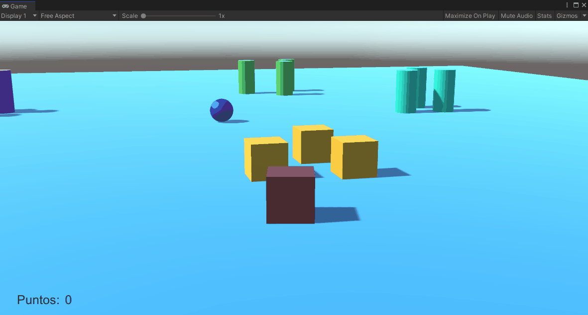

# II_practica3
## Fabio Bianchini Cano

--------------

Cilindros que cambian de color:

  

--------------

>Cuando el jugador se aproxima a los cilindros de tipo A, los cilindros de tipo B cambian su color y las esferas se orientan hacia un objetivo ubicado en la escena con ese propósito.

Este cometido se realiza en los scripts *lookAt* y *ObjectA*.

